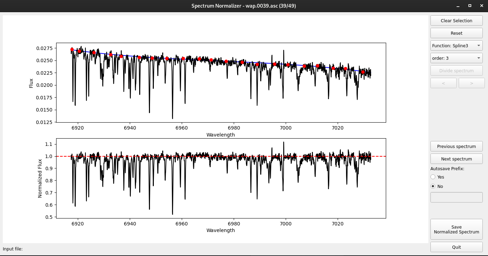

# SaSNoPy

## Description

SaSNoPy - Semiautomatic Spectral Normalization code with Python

SaSNoPy is a Python tool designed for the semi-automatic normalization of astronomical spectra. It proves particularly useful for handling spectral data from various sources, automatically calculating the median of the highest defined points (top-level) in local spectral regions (splits). This tool facilitates the normalization process, making it convenient for further analysis, especially when dealing with long-wavelength range spectra and echelle orders.



## Features

- **Interactive UI**: Provides a graphical user interface (GUI) for easy interaction.
- **Flexible Input Format**: Spectra can be in any ASCII or FIT/FITS format. For now, the output is without a header.
- **List Support**: Can handle a list of spectra, strongly recommended for short wavelength range spectra, like echelle orders.
- **Instantaneous Normalization**: Can graph the normalized spectra and fit instantaneously.
- **Automatic and Non-Automatic Modes**: It can normalize automatically without supervision. The non-automatic way allows users to add and delete points, change the function, clear the points and reset.
- **Keyboard Shortcuts**: Convenient keyboard shortcuts for common actions.

  
## To Do

- **Spectral Division**: Divide a given spectrum into smaller regions based on specified criteria (Currently is included but still is better to improve).
- **Temporary Files**: Save divided spectral regions as temporary files for individual processing.
- **Output header**: Add the option to save on fit/fits with header

## How to Use

1. Install the required libraries:

    ```bash
    pip install -r docs/requirement.txt
    ```

3. Run the program:

    ```bash
    python sasnopy.py input_spec.asc/fit 
    ```
    or with a list:
   
    ```bash
    python sasnopy.py -l input_spec.list
    ```

## Keyboard Shortcuts

- **Clear Selection - C**: Clears the current selection.
- **Reset - R**: Resets the normalization to its initial state with the automatic points.
- **Function**: Select the type of function for normalization.
- **Order**: Sets the order for the selected function.
- **Divide Spectrum**: Initiates the process of dividing the spectrum.
- **< , >**: Navigate to the previous or next division on the same spectrum.
- **Previous Spectrum - Left**: Loads the previous spectrum in the list.
- **Next Spectrum - Right**: Loads the next spectrum in the list.
- **Autosave Prefix, Yes or No**: Enables or disables autosaving with a user-defined prefix.
- **Save Normalized Spectrum - S**: Saves the normalized spectrum.
- **Quit - Q**: Exits the program.
- **- Space**: Performs the actions of both save normalized spectrum and load the next spectrum.

   

## Limitations

- SASNoPy is designed for specific use cases and may not cover all scenarios.
- The division criteria are predefined and may not suit every dataset.

## Versatility

SASNoPy is versatile for normalizing spectra with specific criteria. However, additional tools may be required for more advanced or specialized normalization tasks.

## Creator

- **Mauricio Cabezas**
  
## License

This project is licensed under the [Your License].

## Acknowledgments

- Main idea of 'median level' from [Companion Simulations](https://notebook.community/jason-neal/companion_simulations/Notebooks/Spectrum_Normalizations), No name, no source.
